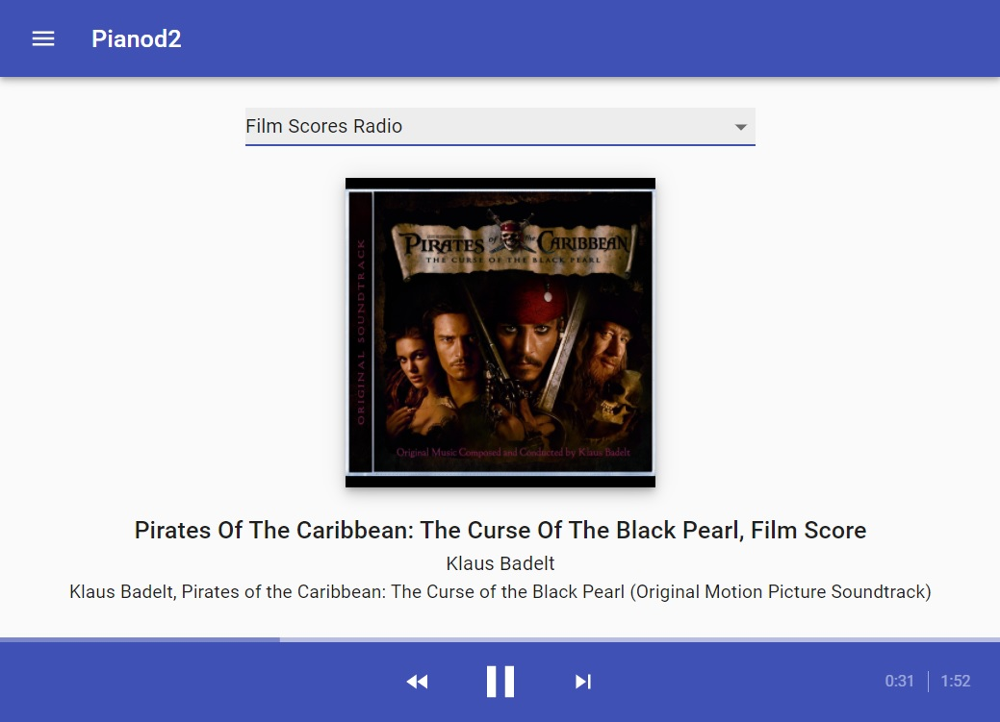

# Pianod2 Pandora UI

The goal of this project is provide a self-hosted Pandora Player with a Web UI.

Its primary use-case is to run on a Media Center with an audio output, like a RaspberryPi with an HQ soundcard.
The player can then be controlled by your Phone or PC.



The entire project is based on the [Pianod2](http://deviousfish.com/Pianod/index.html) media player service and utilizes Docker containers.

Its build artifacts get published as Docker images [here](https://github.com/Finomnis/pianod2-pandora-ui/pkgs/container/pianod2-pandora-ui).

## Raspberry Pi Pandora Player

This guide is specific for Raspberry Pi's (in my case a Raspberry Pi 3B+).
But for other boards, it works similar, probably.

### General Setup

Install your Raspberry Pi like you would usually. Set up a password, enable ssh,
set up your soundcard drivers, and so on.

Make sure that the user you use from now on has the UID and GID `1000`.
By default, the user `pi` has the correct GID/UID, so don't create your own user, just use
the `pi` user.

This is important because that UID/GID is hardcoded when the PulseAudio device gets mounted into the docker container.
I wasn't able to find a proper way to make this configurable. Pull requests welcome.

### PulseAudio Setup

This project uses PulseAudio for audio output. Therefore, it has to be set up and configured correctly.

Install PulseAudio:
```
sudo apt update
sudo apt install pulseaudio pamix
systemctl --user enable pulseaudio
```

If you use the system as a headless setup (= without screen),
PulseAudio only starts if a user is logged in.
Therefore, it is important to enable Auto-Login.

For that, enter `sudo raspi-config` and find and enable the option `Console Autologin`.

Then, configure pulseaudio correctly to get the best possible quality.
The exact setup might be different for everybody,
so I just post my setup for reference (file: `/etc/pulse/daemon.conf`):

```
default-sample-format = float32le
default-sample-rate = 48000
alternate-sample-rate = 44100
default-sample-channels = 2
default-channel-map = front-left,front-right
resample-method = soxr-vhq
enable-lfe-remixing = no
high-priority = yes
nice-level = -11
realtime-scheduling = yes
realtime-priority = 9
rlimit-rtprio = 9
daemonize = no
default-fragment-size-msec = 15
```

The sample rates `48000` and `44100` are important, because those are the sample rates
used by Pandora. (At least I think so, correct me if I'm wrong)


### Docker Setup

Pianod2 itself will be deployed to the Raspberry Pi through a docker image.
Therefore, docker needs to be set up and configured.

Install docker:
```
sudo apt update
sudo apt install docker.io
```

### Portainer

This step is optional, but recommended.

I personally prefer to manage my systems through a UI rather than through command line.
Therefore I use Portainer to manage my Docker containers. Again, this is not required for this
project, but it makes docker and especially docker-compose much easier to manage.

Alternatively, if a command line is preferred, the tool 'docker-compose' has to be installed instead of Portainer.
The installation of docker-compose will not be described here, and later steps will specific for Portainer.

Install portainer:
```
sudo docker volume create portainer_data
sudo docker run -d -p 9000:9000 --name=portainer --restart=always -v /var/run/docker.sock:/var/run/docker.sock -v portainer_data:/data portainer/portainer-ce
```

You can then log into Portainer on `http://<raspberry-pi-ip-address>:9000`.

Log in, create your username and password, and choose that you want to manage a local docker installation.


### Create and run Pianod2 container

Inside or portainer, click on your instance, and select the `Stacks` menu. Click `Add stack`, name it whatever you want, and use the following docker-compose config for it:

```
version: "2"
services:
  pianod2:
    container_name: pianod2
    image: "ghcr.io/finomnis/pianod2-pandora-ui"
    restart: unless-stopped
    volumes:
        - /run/user/1000/pulse:/run/user/1000/pulse
        - "pianod2_config:/home/pi/.config/pianod2"
    ports:
        - 80:80
        - 4446:4446
volumes:
  pianod2_config:
    driver: local
```

Explanation:

- `image: "ghcr.io/finomnis/pianod2-pandora-ui"`: This image gets built from this repository. It contains Pianod2 and the web ui.
  This image is tagged manually to whenever there is a proper release. If you want to use the latest version, use `ghcr.io/finomnis/pianod2-pandora-ui:main`.
- `/run/user/1000/pulse:/run/user/1000/pulse`: This volume mounts in the pulseaudio device, giving the container the capability to play audio.
                                               As previously mentioned, this only works if the host user has the UID/GID `1000`.
- `"pianod2_config:/home/pi/.config/pianod2"`: This is the persistent configuration file of Pianod2. It might require editing,
                                               like setting the Pandora username/password, but we will talk about that later.
- `80:80` and `4446:4446`: Those are the ports that the Web UI will use. `80` is the http port, and `4446` is the control port of Pianod2.


### Pianod2 Configuration

The only thing left to do is to configure Pianod2.

For that, open a root shell in your running Pianod2 container.
Then, make sure that the config directory has the correct ownership (for some reason that gets messed up sometimes):

```
chmod pi:pi /home/pi/.config
```

Then, open the Pianod2 config file. If it does not exist,
create it and paste the [recommended content](https://github.com/Finomnis/pianod2-pandora-ui/blob/main/docker/recommended-pianod2-startscript) into it.
```
vim /home/pi/.config/pianod2/startscript
```

Most of the settings can be left as they are, but some might need adjusting.
For the full reference of commands, look at http://deviousfish.com/Pianod/Documentation/commands.html.

- `SET HISTORY LENGTH <number>` - Sets the number of songs that can be seen in the song history. I set mine to `20`.
- `PANDORA USER <username> <password> ACCOUNT TYPE PLUS` - The username/password of Pandora. Note the `TYPE PLUS` - Pianod2 does not work with Pandora Free accounts, as it can not deal with the forced advertisements.
  Therefore buy a Pandora account if you want to use this project.
- Add `CONTROL PROXY <proxy>` to the `PANDORA` command if you want to use Pianod2 from a non-US country. I can recommend proxy services like https://webshare.io.
- `ROOM RECONFIGURE DRIVER pulse` - choose pulse as the audio output
- `ROOM RECONFIGURE LIBRARY libao` - required for this docker, as Pianod2 is only built with libao support. Note that this line has to come *after* `ROOM RECONFIGURE DRIVER`.
- `CROSSFADE DURATION 0` - personal preference.

### Finished!

Now when you restart your container (or the entire Raspberry Pi), the Web UI should be reachable under `http://<raspberry-pi-ip-address>`.

__Bonus information__: Now that you have a Raspberry Pi that is configured to play audio from Docker containers, you can of course build your own Docker containers for it. I for example have a simple `librespot` container running next to the Pianod2 one, which allows me quick and easy Spotify casting onto the Raspberry Pi. Be creative and have fun!


# Developer Information

This project was bootstrapped with [Create React App](https://github.com/facebook/create-react-app), using the [Redux](https://redux.js.org/) and [Redux Toolkit](https://redux-toolkit.js.org/) template.

## Available Scripts

In the project directory, you can run:

### `npm start`

Runs the app in the development mode.<br />
Open [http://localhost:3000](http://localhost:3000) to view it in the browser.

The page will reload if you make edits.<br />
You will also see any lint errors in the console.

### `npm test`

Launches the test runner in the interactive watch mode.<br />
See the section about [running tests](https://facebook.github.io/create-react-app/docs/running-tests) for more information.

### `npm run build`

Builds the app for production to the `build` folder.<br />
It correctly bundles React in production mode and optimizes the build for the best performance.

The build is minified and the filenames include the hashes.<br />
Your app is ready to be deployed!

See the section about [deployment](https://facebook.github.io/create-react-app/docs/deployment) for more information.

## Learn More

You can learn more in the [Create React App documentation](https://facebook.github.io/create-react-app/docs/getting-started).

To learn React, check out the [React documentation](https://reactjs.org/).

### Code Splitting

This section has moved here: https://facebook.github.io/create-react-app/docs/code-splitting

### Analyzing the Bundle Size

This section has moved here: https://facebook.github.io/create-react-app/docs/analyzing-the-bundle-size

### Making a Progressive Web App

This section has moved here: https://facebook.github.io/create-react-app/docs/making-a-progressive-web-app

### Advanced Configuration

This section has moved here: https://facebook.github.io/create-react-app/docs/advanced-configuration

### Deployment

This section has moved here: https://facebook.github.io/create-react-app/docs/deployment

### `npm run build` fails to minify

This section has moved here: https://facebook.github.io/create-react-app/docs/troubleshooting#npm-run-build-fails-to-minify
